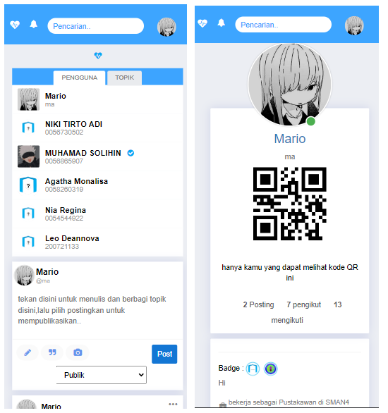

# 4room
formerly name : blueArchive  

  

adalah aplikasi kartupelajar berbasis webforum yang awalnya dibuat untuk menampung alumni dan siswa(i) agar tetap terhubung
repo ini digunakan pada situs kartupelajar pada SMAN 4 Muara Teweh. 
aplikasi ini di optimalkan untuk pengguna mobile atau resolusi bidang dibawah rata-rata resolusi bidang desktop. 

ini ditulis dengan menggunakan bahasa  
-Jawascript 
-php 

yang diperlukan:
niat 
php 5.6 dengan module intl aktif 
mysql 5.0 

<h4>Cara Pasang:</h4>

Singkat cerita , silahkan gunakan xampp dengan versi php minimal 5.6 
atau 
1.install xampp dengan php minimal 5.6 dan aktifkan module intl pada php.ini nya 
2.unduh repo ini lalu ekstrak ke htdocs/ pada folder xampp 
3.atur database dan sesuaikan ,pengaturan terdapat pada config/config.php sesuai dengan database yang telah disediakan pada repo 
4.satsetsatset

 
catatan : ini belum dapat berjalan pada php versi 8 atau diatasnya , juga untuk bahan ajar atau alat ajar untuk siswa(i) ,mohon untuk tidak memperjual belikan source code ini,atas perhatiannya,terima kasih.
